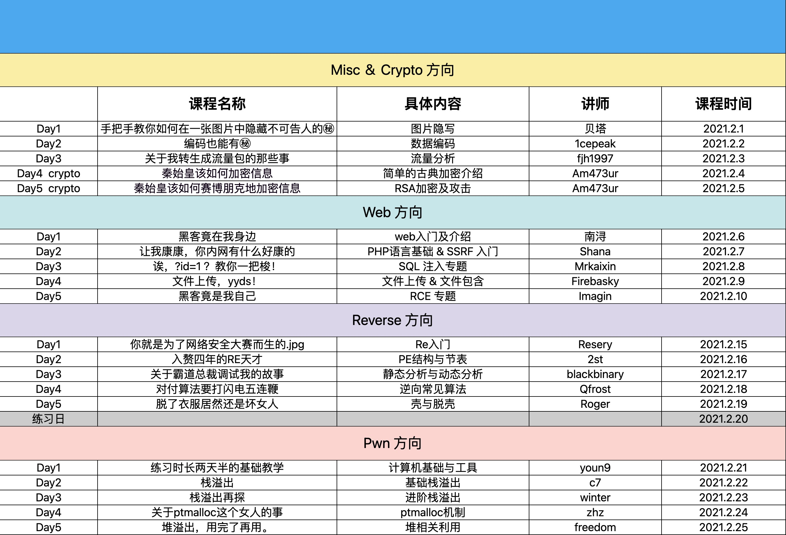

# 涅普计划

#### 课表

#### 附件

第一天课件(misc1-图片隐写)：20200201_nep_project1.rar

第二天课件(misc2-数据编码)：20200202_nep_project2.zip

第三天课件(misc3-流量分析)：20200202_nep_project3.zip

第四天课件(cry-古典密码学简介)：20200201_nep_project4.zip

第五天课件(cry-rsa加密与攻击)：20200201_nep_project5.zip

第六天课件(web1-web入门简介 工具见下方)：20200201_nep_project6.zip

第七天课件(web2-php&&ssrf)：20210201_nep_project7.zip

第八天课件(web3-sql注入)：20210201_nep_project8.zip

第九天课件(web4-文件上传)：20210201_nep_project9.rar

第十天课件(web5-rce专题)：20210201_nep_project10.zip

第十一天课件(re1-x86汇编)：20210201_nep_project11.zip

第十二天课件(re2-pe结构)：20210201_nep_project12.zip

第十三天课件(re3-静态分析与动态分析)：20210201_nep_project13.zip

第十四天课件(re4-加解密算法)：20210201_nep_project14.rar

第十五天课件(re5-壳与脱壳)：20210201_nep_project15.zip

第十六天课件(pwn1-pwn工具使用)：20210201_nep_project16.zip

第十七天课件(pwn2-栈溢出)：20210201_nep_project17.zip

第十八天课件(pwn3-栈溢出进阶)：20210201_nep_project18.zip

第十九天课件(pwn4-ptmalloc机制)：20210201_nep_project19.zip

第二十天课件(pwn5-堆溢出基本利用)：20210201_nep_project20.zip

第二十一天课件(src1-WEB安全入门基础)：20210201_nep_project21.zip

#### 回放

第九天回放（未剪辑）：
链接: https://pan.baidu.com/s/12yrptg85evI-XS733mnKrw
提取码：0sub

第十天回放（未剪辑）：
链接: https://pan.baidu.com/s/10UMmahGU31PhiKdDxFHRtQ
提取码：fbqc

第十一天回放（重制版）：
链接: https://pan.baidu.com/s/1_cpHdTQr3O6t5ukALbyqAQ
提取码：837c

第十一天回放（无声版）：
链接: https://pan.baidu.com/s/1HEZz7mBEcRroPQiLE6U0Cw
提取码：6h0p

第十二天回放（未剪辑）：
链接: https://pan.baidu.com/s/1Wc_jwvmoolTRr42L4zvfKQ
提取码：drj0

第十三天回放（未剪辑）：
链接: https://pan.baidu.com/s/1Zy52tMdP-LT_GFHeV7J5AQ
提取码：wi6j

第六天工具：
链接: https://pan.baidu.com/s/1MmaoYiyFtmA73hoWC27-Vg
提取码: 8khc